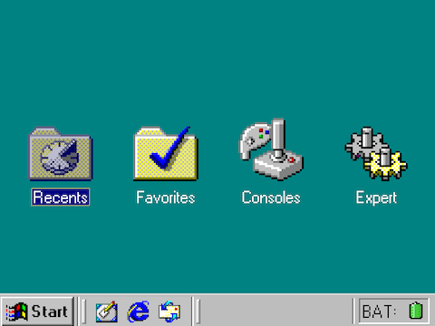
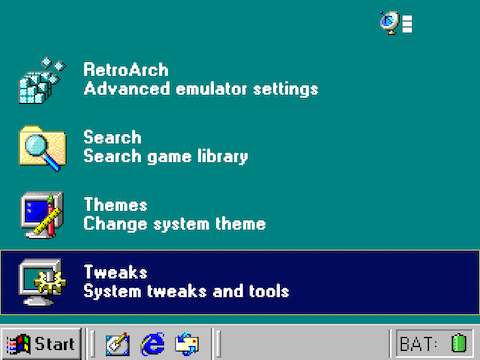
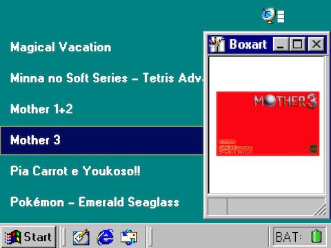

# onion98
_a theme for onionOS_

|         Home screen            |           Settings menu          |         Games list            |
| ------------------------------ | -------------------------------- | ----------------------------- |
|  |  |  |
  

This theme is a heavily modified version of the *win98* theme by _kyhynngy_oyuur_, which can be downloaded from the [OnionUI themes repository](https://github.com/OnionUI/Themes?tab=readme-ov-file).

The theme includes the W95FA font which is licensed under the SIL Open Font License.

All Windows icons were taken from the [Windows 98 Icon Viewer](https://win98icons.alexmeub.com/) and [old windows icons](https://oldwindowsicons.tumblr.com/) on tumblr. 

Feel free to use or edit this theme in any way you wish.  Go hog wild my friend.

## How to install
If you only want to install the base theme, just download the onion98.zip file and copy to the Themes folder on your SD card (no need to unzip).

Additional icons can be changed via the Tweaks menu by going to Apps > Tweaks > Appearance > Icon Packs > Apply Icon Pack and selecting the onion98 pack.

As of right now, there are replacement icons for the Tweaks menu itself, as well as console icons for MS DOS and Windows 3.1 - sadly, no custom console icons yet.

## Coming soon
- Custom console icons in a Windows 98 style!
- Improved menus/buttons!
